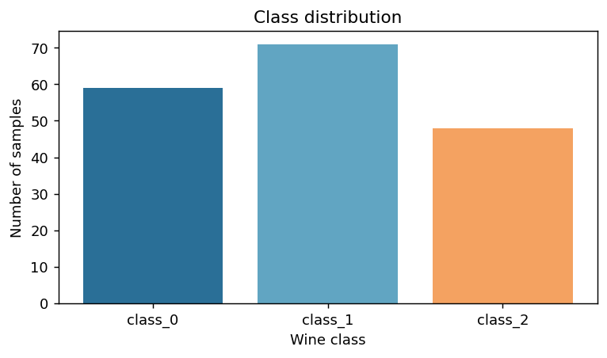
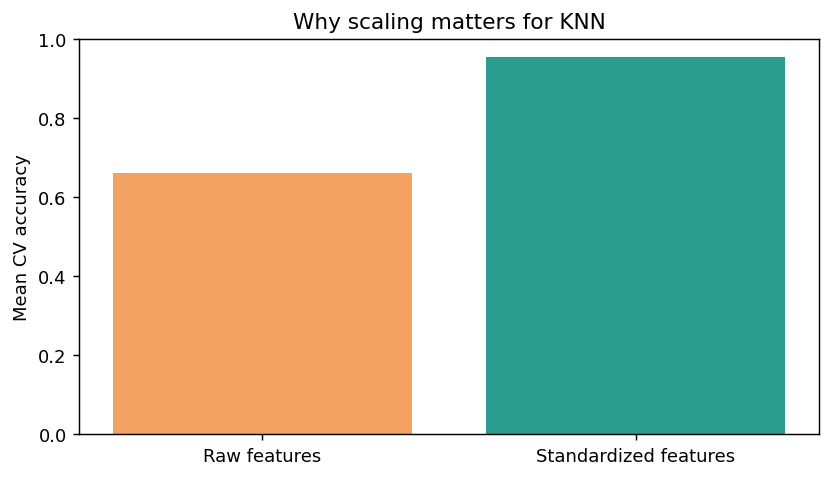
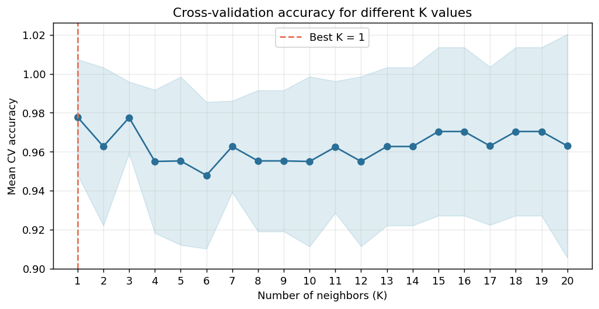
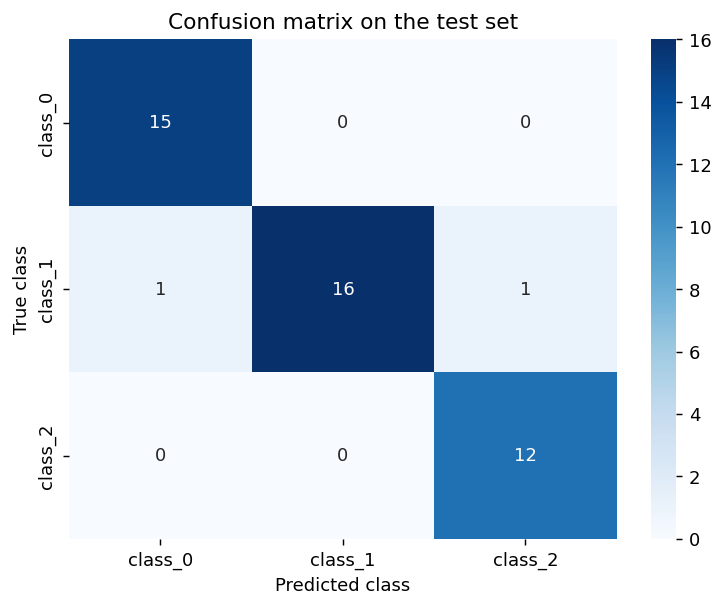

# K近邻算法：从距离到预测

本项目使用 `scikit-learn` 的 `KNeighborsClassifier` 完成 Wine 数据集的多分类任务，重点讲解 KNN 的工作机制、特征缩放、K 值选择、距离加权和模型评估。

## 一、学习目标

完成本案例后，应能够：

1. 说明 KNN 如何通过距离和邻居投票完成分类；
2. 解释 `n_neighbors`、`weights`、`metric`、`p` 等参数；
3. 说明特征缩放为什么会显著影响 KNN；
4. 使用交叉验证选择参数；
5. 在独立测试集上评估最终模型；
6. 使用 `kneighbors()` 查看一次预测所依据的邻居。

## 二、运行环境

建议使用 Python 3.10 或更高版本。安装依赖：

```bash
pip install numpy pandas matplotlib seaborn scikit-learn jupyter
```

启动 Notebook：

```bash
jupyter notebook KNN_sklearn算法讲解.ipynb
```

Wine 数据集由 sklearn 内置，运行时不需要联网下载数据。

## 三、KNN 的基本原理

对于一个待预测的新样本，KNN 执行以下步骤：

1. 计算新样本与训练样本之间的距离；
2. 找出距离最近的 K 个训练样本；
3. 分类任务采用投票法，回归任务采用平均法；
4. 将投票最多的类别作为分类结果。

KNN 几乎没有传统意义上的参数学习过程。`fit()` 主要保存训练数据，较多计算发生在预测阶段，因此 KNN 常被称为“懒惰学习”。

## 四、数据集与任务

本案例使用 sklearn 自带的 Wine 数据集：

- 样本数：178；
- 输入特征：13 个葡萄酒化学指标；
- 目标类别：3 类；
- 任务类型：有监督多分类。

```python
from sklearn.datasets import load_wine

wine = load_wine(as_frame=True)
X = wine.data.copy()
y = wine.target.copy()

print(X.shape)              # (178, 13)
print(wine.target_names)    # ['class_0', 'class_1', 'class_2']
```

数据中的三个类别数量如下：



## 五、划分训练集和测试集

测试集必须与训练、模型选择和调参过程分开。本案例保留 25% 的样本作为最终测试集，并使用分层抽样保持类别比例。

```python
from sklearn.model_selection import train_test_split

X_train, X_test, y_train, y_test = train_test_split(
    X,
    y,
    test_size=0.25,
    random_state=42,
    stratify=y,
)
```

划分结果：

- 训练集：133 个样本；
- 测试集：45 个样本。

## 六、`KNeighborsClassifier` 的主要参数

| 参数 | 作用 | 说明 |
|---|---|---|
| `n_neighbors` | 邻居数量 K | K 太小容易受噪声影响，K 太大可能模糊局部结构 |
| `weights` | 投票权重 | `uniform` 表示等权；`distance` 表示距离越近权重越大 |
| `metric` | 距离度量 | 默认值为 `minkowski` |
| `p` | 闵可夫斯基距离的阶数 | `p=1` 为曼哈顿距离，`p=2` 为欧氏距离 |
| `algorithm` | 近邻搜索方法 | 可选 `auto`、`brute`、`kd_tree` 或 `ball_tree` |
| `leaf_size` | 树搜索的叶节点规模 | 影响 KD 树和 Ball Tree 的速度与内存占用 |

一个最基本的 KNN 分类器如下：

```python
from sklearn.neighbors import KNeighborsClassifier

model = KNeighborsClassifier(
    n_neighbors=5,
    weights="uniform",
    metric="minkowski",
    p=2,
)

model.fit(X_train, y_train)
y_pred = model.predict(X_test)
```

## 七、特征缩放为什么重要

KNN 根据距离寻找邻居，因此特征的数值尺度会直接影响结果。Wine 数据中的 `proline` 取值范围超过 1200，而 `nonflavanoid_phenols` 的范围只有约 0.5。若直接计算距离，数值范围较大的特征会占据主导地位。

本案例使用 `StandardScaler` 将各特征转换为均值接近 0、标准差接近 1 的尺度。缩放器与分类器共同放入 `Pipeline`，确保交叉验证的每一折只使用该折训练数据计算缩放参数。

```python
from sklearn.pipeline import Pipeline
from sklearn.preprocessing import StandardScaler

scaled_model = Pipeline([
    ("scaler", StandardScaler()),
    ("knn", KNeighborsClassifier(n_neighbors=5)),
])
```

训练集 5 折交叉验证结果：

| 输入数据 | 平均准确率 | 标准差 |
|---|---:|---:|
| 未缩放特征 | 0.6615 | 0.0637 |
| 标准化特征 | 0.9553 | 0.0431 |



该结果说明，在本数据集上，忽略量纲差异会严重影响 KNN 的距离计算。后续实验均使用标准化后的特征。

## 八、通过交叉验证选择 K 值

为了单独观察 K 的影响，先固定等权投票和欧氏距离，在训练集上使用 5 折交叉验证测试 K=1～20。

```python
import numpy as np
from sklearn.model_selection import StratifiedKFold, cross_val_score

cv = StratifiedKFold(n_splits=5, shuffle=True, random_state=42)
k_values = range(1, 21)
k_means = []

for k in k_values:
    model = Pipeline([
        ("scaler", StandardScaler()),
        ("knn", KNeighborsClassifier(
            n_neighbors=k,
            weights="uniform",
            p=2,
        )),
    ])
    scores = cross_val_score(
        model,
        X_train,
        y_train,
        cv=cv,
        scoring="accuracy",
    )
    k_means.append(scores.mean())

best_k = list(k_values)[int(np.argmax(k_means))]
```



在固定等权投票和欧氏距离时，本次运行得到的最佳 K 为 1，平均交叉验证准确率为 0.9778。这个结果只适用于当前数据和划分方式，不代表 K=1 对所有任务都最好。

## 九、等权投票与距离加权

`weights` 决定邻居如何参与投票：

- `uniform`：所有邻居权重相同；
- `distance`：距离越近的邻居权重越大。

在固定 K 和欧氏距离的比较中，本次运行得到：

| 投票方式 | 平均交叉验证准确率 | 标准差 |
|---|---:|---:|
| `uniform` | 0.9778 | 0.0296 |
| `distance` | 0.9778 | 0.0296 |

两种方式在这一设置下结果相同。是否采用距离加权仍应根据训练数据上的交叉验证结果判断。

## 十、使用 `GridSearchCV` 联合调参

下面同时搜索 K 值、投票方式和距离类型。所有参数选择都在训练集内部完成。

```python
from sklearn.model_selection import GridSearchCV

pipeline = Pipeline([
    ("scaler", StandardScaler()),
    ("knn", KNeighborsClassifier(algorithm="auto")),
])

param_grid = {
    "knn__n_neighbors": list(range(1, 21)),
    "knn__weights": ["uniform", "distance"],
    "knn__p": [1, 2],
}

grid_search = GridSearchCV(
    estimator=pipeline,
    param_grid=param_grid,
    cv=cv,
    scoring="accuracy",
    n_jobs=-1,
)

grid_search.fit(X_train, y_train)

print(grid_search.best_params_)
print(grid_search.best_score_)
```

本次运行结果：

```text
最佳参数：
{
    'knn__n_neighbors': 4,
    'knn__p': 1,
    'knn__weights': 'distance'
}

最佳交叉验证准确率：0.9926
```

`p=1` 表示最终模型使用曼哈顿距离。多个参数组合获得了相同的平均交叉验证准确率，因此最佳参数不是唯一可能的合理方案。

## 十一、最终测试集评估

`GridSearchCV` 会使用最佳参数在完整训练集上重新拟合模型。参数确定后，再使用此前保留的测试集进行一次最终评估。

```python
from sklearn.metrics import (
    accuracy_score,
    classification_report,
    confusion_matrix,
)

best_model = grid_search.best_estimator_
y_pred = best_model.predict(X_test)

print(accuracy_score(y_test, y_pred))
print(classification_report(
    y_test,
    y_pred,
    target_names=wine.target_names,
))
```

测试集准确率为 **0.9556**，即 45 个测试样本中有 43 个分类正确。

| 类别 | Precision | Recall | F1-score | 样本数 |
|---|---:|---:|---:|---:|
| `class_0` | 0.9375 | 1.0000 | 0.9677 | 15 |
| `class_1` | 1.0000 | 0.8889 | 0.9412 | 18 |
| `class_2` | 0.9231 | 1.0000 | 0.9600 | 12 |



混淆矩阵表明，两次错误都来自真实类别 `class_1`。分类报告与混淆矩阵共同说明了错误出现在哪个类别，仅看总体准确率无法提供这些信息。

## 十二、查看一次预测所依据的邻居

最终模型是一个 `Pipeline`。使用 `kneighbors()` 时，要先用相同的缩放器处理待预测样本。

```python
sample = X_test.iloc[[0]]

scaler = best_model.named_steps["scaler"]
knn = best_model.named_steps["knn"]

sample_scaled = scaler.transform(sample)
distances, positions = knn.kneighbors(sample_scaled)
neighbor_labels = y_train.iloc[positions[0]].to_numpy()

print("预测类别：", best_model.predict(sample)[0])
print("归一化投票权重：", best_model.predict_proba(sample)[0])
print("最近邻距离：", distances[0])
print("最近邻标签：", neighbor_labels)
```

本次运行选择的样本真实类别和预测类别均为 `class_0`，四个最近邻的标签也均为 0。

## 十三、常用属性和方法

| 接口 | 含义 |
|---|---|
| `fit(X, y)` | 保存训练样本并建立所需的搜索结构 |
| `predict(X)` | 输出预测类别 |
| `predict_proba(X)` | 输出各类别归一化后的投票权重 |
| `kneighbors(X)` | 返回最近邻的距离和位置 |
| `score(X, y)` | 分类器默认返回准确率 |
| `classes_` | 训练数据中的类别 |
| `effective_metric_` | 模型实际采用的距离度量 |
| `n_samples_fit_` | 模型保存的训练样本数 |

最终模型的部分属性：

```text
classes_: [0 1 2]
effective_metric_: manhattan
n_samples_fit_: 133
algorithm: auto
```

`predict_proba()` 的结果来自邻居投票权重，不应直接视为经过概率校准的真实概率。

## 十四、KD 树与搜索方式

线性扫描需要计算查询样本与所有训练样本之间的距离。sklearn 还提供 KD 树和 Ball Tree 等搜索方式：

```python
KNeighborsClassifier(algorithm="kd_tree")
KNeighborsClassifier(algorithm="ball_tree")
KNeighborsClassifier(algorithm="brute")
KNeighborsClassifier(algorithm="auto")
```

`algorithm="auto"` 会根据输入数据和模型设置选择搜索方式。KD 树通常更适合维度较低的数据；随着维度增加，树结构的搜索优势可能下降。本案例保留 `auto`，不手写 KD 树。

## 十五、优点与局限

### 优点

- 原理直观，预测依据容易解释；
- 几乎不需要传统意义上的训练过程；
- 可以用于分类和回归；
- 能够形成非线性的决策边界。

### 局限

- 预测时需要搜索近邻，数据量大时开销较高；
- 对特征尺度、K 值和距离度量敏感；
- 高维空间中可能出现“维度灾难”；
- 无关特征会干扰距离计算；
- 类别不平衡时，多数类别可能在邻居投票中占优势。

## 十六、实验结论

本案例的完整流程为：

```text
划分数据
  → Pipeline 内标准化
  → 训练集交叉验证
  → GridSearchCV 选择参数
  → 独立测试集评估
  → 查看一次预测的近邻依据
```

本次实验最明显的结果是：标准化前后的平均交叉验证准确率分别为 0.6615 和 0.9553。这说明特征尺度会直接改变距离，并进一步影响 KNN 的预测。最终模型在独立测试集上的准确率为 0.9556。

这些数值是固定随机种子和当前软件环境下的实验结果，不应被解释为 KNN 在所有数据集上的固定性能。

## 参考材料

1. 课程材料：《第2讲 K近邻法（2025课件）》；
2. 课程材料：《第2讲 K近邻法（哆啦A梦版）》；
3. scikit-learn：`sklearn.neighbors.KNeighborsClassifier`。
